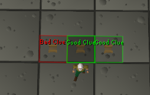

# Level 3 Clues

A RuneLite plugin that indicates whether a clue scroll is considered "good" or "bad" for Level 3 skillers. The plugin overlays information to help players identify clues that may require combat, entering Morytania, or are otherwise inaccessible to Level 3 accounts.

## Features

- Shows an indicator for each clue scroll: **Good Clue** or **Bad Clue** for Level 3 skillers
- Highlights clue tiles with customizable colors
- Automatically detects clue types and requirements
- Considers quest-locked and dangerous areas (such as Morytania)

## Configuration

You can change plugin settings in the plugin panel:
- Show Level 3 Skiller Indicator: Toggle the clue rating overlay.
- Enable Clue Highlights: Highlight the clue tile location in the game world.
- Customize colors for "good" and "bad" clue tiles.

## Installation

1. Download or clone this repository.
2. Build using [RuneLite Plugin Hub workflow](https://github.com/runelite/plugin-hub).
3. Copy the plugin to your RuneLite plugins folder or add it to your custom RuneLite client.
4. Enable the **Level 3 Clues** plugin from the in-game plugin panel.

## Contributing

Contributions are welcome! If you have suggestions for additional clue logic or area restrictions, open an issue or submit a pull request.

## Credits

- Inspired by community requests for skiller-friendly clue assistance.
- Built using the RuneLite API.

## License

[MIT](LICENSE)